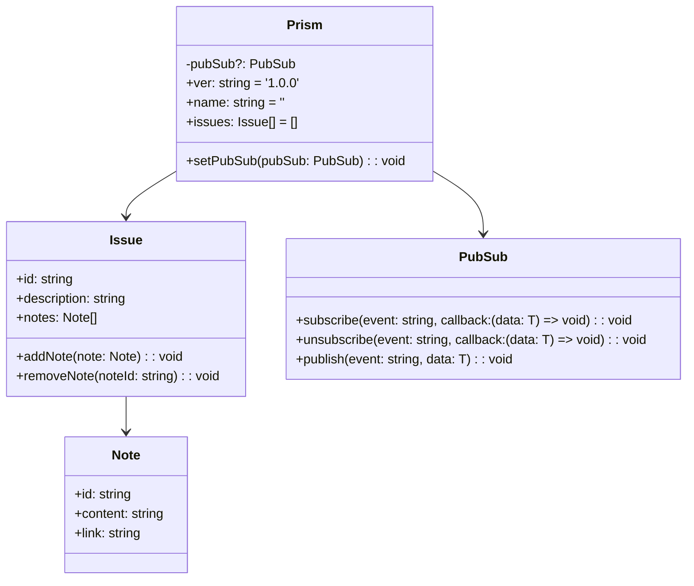

# Prism, Issue, Note class diagram

> This markdown file is for 'Prism'.
>
> [code](/src/code-prism/Prism.ts#66-#66): d:\Samuel\NegahamaOrg.CodePrism/src/code-prism/Prism.ts#66-#66
>
> You can edit this file to add more information about 'Prism, Issue, Note class diagram'.

---

