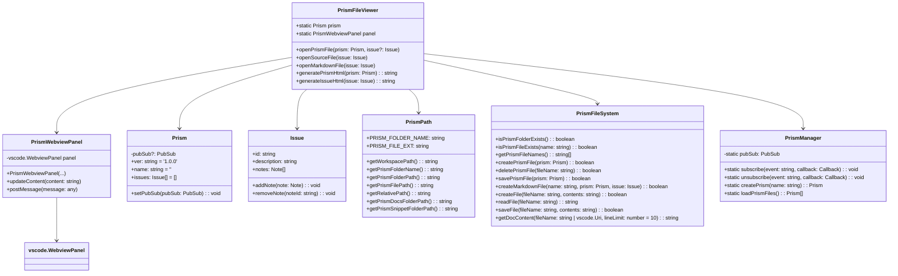

# PrismFileViewer's mermaid classDiagram

> This markdown file is for 'PrismFileViewer'.
>
> [code](/src/code-prism/PrismFileViewer.ts#178-#178): d:\Samuel\NegahamaOrg.CodePrism/src/code-prism/PrismFileViewer.ts#178-#178
>
> You can edit this file to add more information about 'PrismFileViewer's mermaid classDiagram'.

---

