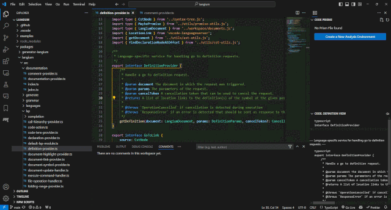
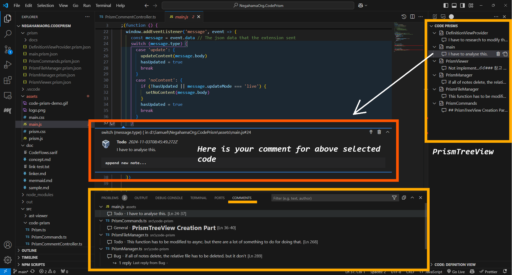
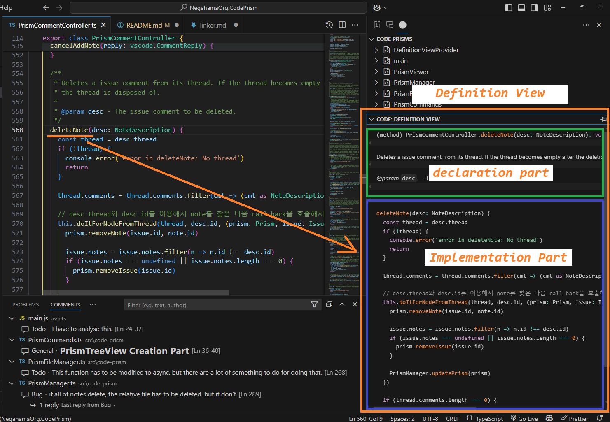
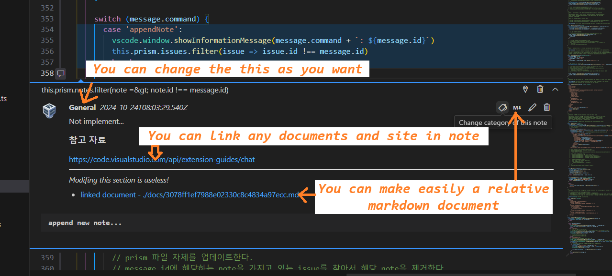

# Code Prism

## 🔗 What is it?

**Code Prism extension** is a tool that can record and store various information generated during code analysis.

When we analyze the code, many meta-data could occur, such as summary of what we analyzed, what to do, additional requests, related documents and so on. These metadata could be written and stored in a separate file, but keeping these meta-data as a separate file is very cumbersome and, above all, very inefficient because meta-data and code are not interconnected.

This extension is for these cases, _this extension manage these meta-data associated with code without modifying the code._

In fact, Code Prism is not just for source code, it is for all documents. so it allows you to leave the necessary comments on all kinds of documents(.md, .json, etc.) as well as the source code

Code Prism is basically a code review program. but it's simple to use and includes useful features for code analysis.

**_Enjoy!_**

## Getting Started

In order to get started, install the [CodePrism extension](https://marketplace.visualstudio.com/items?itemName=NegahamaOrg.codeprism), and then following one of the following guides:

- [Concept](#concept)
- [Features](#features)

## Concept

Many developers spend as much time understanding and analyzing systems developed by others as developing their own programs.

Sometimes you simply refer to a well-defined API, but sometimes you need to know enough about that system to participate in the development process. In this case, understanding and analyzing large and complex systems is a challenging task.

It's not just the individual's ability and effort that you need when you want to understand what purpose this function was used, why they use it like this, and how it might affect other parts of the system.

Code prism aims to help you understand and analyze systems

There are a number of tools available to assist with analysis. These tools analyze the code on their own and display their information in documents and diagrams.

Of course, we have to use these tools. But I think it's important to help you find the Aha-moment among the many pieces of information that a lot of tools give out.

In the process of understanding and analysis, I noted that there are more information to be searched, referenced, and recorded than I thought.

So I'm trying to make a tool that the whole system can come in at a glance by showing useful information as much as and effectively .

As a starting point, I'm going to start with something that can be easily viewed and recorded with various information generated in the analysis process, related documents, sites, my own comments, and so on.

## Features

Code Prism is consist of 3 parts

- Recording metadata
- Auto-search information of symbol
- link documents(markdown file) to source

### Recoding metadata

- Manage information associated with a specific part of the document without changing the source.

#### Prism file

The prism file and the document correspond one-to-one, and one prism file may contain multiple `Issue`s.

#### Issue

`Issue` is opinions on specific parts of the document. Therefore, `Issue` is linked to specific parts of the document and can have multiple `Note`s.

#### Note

`Note` is opinion and information, it can be simple text, link, image, video and document.

### Auto-search

- Automatically displays definition information for the symbol at the current cursor position.
- Language independent. Works in any language that supports hovers.
- Supports syntax highlighting and markdown rendering in the docs view.

### link documents

## 🔗 Release Notes

### 1.3.1 - November 6, 2024

changed icon color and tooltip content of prism tree view and bug fix.

### 1.3.0 - November 6, 2024

1. appended new commands about finding and searching(eg. Find All Reference, Open Search Editor, and so on) in DefinitionView.
2. appended new PrismView's mode(Issue List Mode) and implemented sorting of tree item by name, category, created time.
3. appended the method of modifying note's category(you can changed the category when you write the comment)
4. improved some stuff of display and performance.
5. bug fixes.

### 1.2.0 - November 3, 2024

1. implement to cahnge issue's position
2. implement to change note's category
3. implement to make markdown file related the note

## 💚 Code Prism is base of 💚

- [Comment Linker](https://marketplace.visualstudio.com/items?itemName=antunesdq.comment-linker)
- [Docs View](https://marketplace.visualstudio.com/items?itemName=bierner.docs-view)
- [Definition View](https://marketplace.visualstudio.com/items?itemName=stevepryde.definition-view)
- [Code Explorer](https://marketplace.visualstudio.com/items?itemName=tianjianchn.code-explorer)
- [Project Notes](https://marketplace.visualstudio.com/items?itemName=willasm.pnotes)
- [CodeTour](https://marketplace.visualstudio.com/items?itemName=vsls-contrib.codetour)

## 🔗 Following extension guidelines

Ensure that you've read through the extensions guidelines and follow the best practices for creating your extension.

- [Extension Guidelines](https://code.visualstudio.com/api/references/extension-guidelines)

## 🔗 For more information

- [Visual Studio Code's Markdown Support](http://code.visualstudio.com/docs/languages/markdown)
- [Markdown Syntax Reference](https://help.github.com/articles/markdown-basics/)
