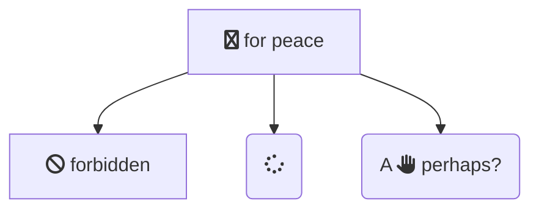
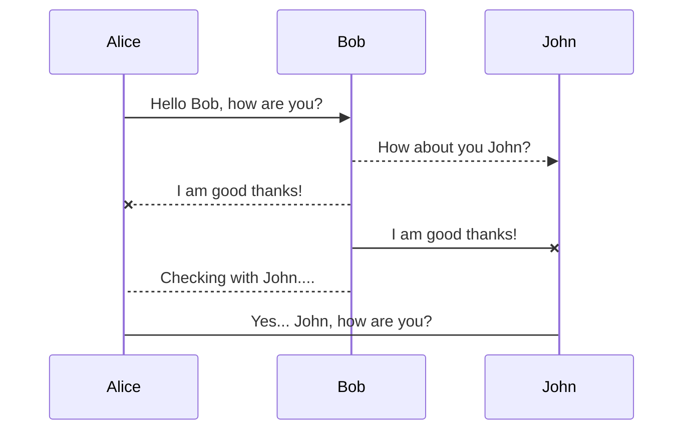

# mermaid

## todo

codelens 기능을 이용해서 해당 기능을 커맨드 방식이 아니라 클릭으로 기동되게 해야 한다.

previewer를 정리해야 한다.

```mermaid
graph TD
    B["fa:fa-twitter for peace"]
    B-->C[fa:fa-ban forbidden]
    B-->D(fa:fa-spinner);
    B-->E(A fa:fa-hand-paper perhaps?);
```

```mermaid
sequenceDiagram
    Alice ->> Bob: Hello Bob, how are you?
    Bob-->>John: How about you John?
    Bob--x Alice: I am good thanks!
    Bob-x John: I am good thanks!

    Bob-->Alice: Checking with John....
    Alice->John: Yes... John, how are you?
```
